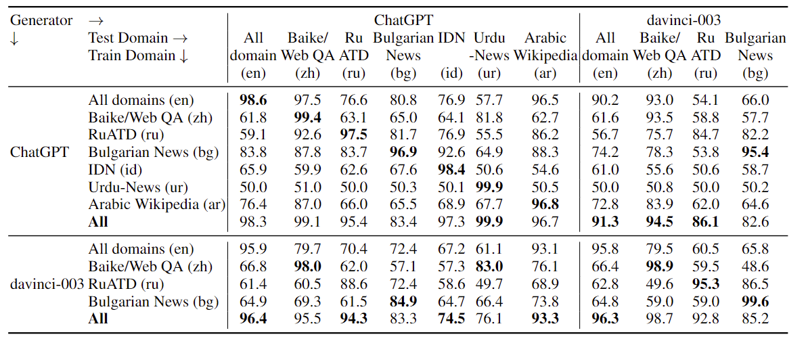
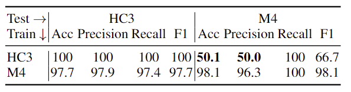

# M4: Multi-generator, Multi-domain, and Multi-lingual Black-Box Machine-Generated Text Detection

Large language models (LLMs) are becoming mainstream and easily accessible, ushering in an explosion of machine-generated content over various channels, such as news, social media, question-answering forums, educational, and even academic contexts. Recent LLMs, such as ChatGPT and GPT-4, generate remarkably fluent responses to a wide variety of user queries. The articulate nature of such generated text makes LLMs attractive for replacing human labor in many scenarios. However, this has also resulted in concerns regarding their potential misuse, such as spreading misinformation and causing disruptions in the education system. Since humans perform only slightly better than chance when classifying machine-generated vs. human-written text, there is a need to develop automatic systems to identify machine-generated text with the goal of mitigating its potential misuse. 

We construct the dataset M4, and additionally study the performance of automatic detectors from various perspectives: (1) different detectors across different domains for a specific generator; (2) different detectors across different generators for a specific domain; (3) interactions of domains and generators in a multilingual setting, and (4) the performance of the detector on data generated from different time domains. From this, we draw some interesting observations.


<!-- TOC -->

- [Data](#data)
- [Models](#models)
- [Evaluation](#evaluation)
- [Citation](#citation)

<!-- /TOC -->

## Data
Here are the statistics information about the M4 dataset. It will be further extended in SemEval 2014 shared task 8 with surprising generators, domains and languages. 
<p align="center" width="100%">
    <a></a>
</p>


## Models
* RoBERTa, ELECTRA and XLM-R detector: fine-tune pre-trained RoBERTa, ELECTRA and XLM-R to detect machine-generated text.
* Logistic Regression with GLTR Features
* SVM classifier with Stylistic/NEws LAndscape (NELA) Features


## Evaluation
We evaluate detectors in five settings:
### Same-Generator, Cross-Domain
Accuracy of cross-domain experiments: given generations from ChatGPT (top) or davinci (bottom),train on a single domain and test across domains across five detectors.
<p align="center" width="100%">
    <a></a>
</p>

### Same-Domain, Cross-Generator
Accuracy of cross-generator experiments: train and test on arXiv (top) and Wikipedia (bottom) across
five detectors, over single machine-text generator vs human. 
<p align="center" width="100%">
    <a></a>
</p>

### GPTZero 
Zero-shot detection with GPTZero: recall (Rec) and F1-score with respect to generators and domains.
<p align="center" width="100%">
    <a></a>
</p>

### Multilingual Evaluation 
Accuracy (%) based on XLM-R on test sets across different languages over ChatGPT and davinci-003.
<p align="center" width="100%">
    <a></a>
</p>

### Time Domain Evaluation
Impact of ChatGPT updating by time. Accuracy (Acc), Precision (Prec), Recall and F1 scores(%) with respect to machine generations for Reddit-ELI5 from HC3 and M4 datasets based on XLM-R. HC3 dataset prompt ChatGPT earlier than M4 (Jan vs May).
<p align="center" width="100%">
    <a></a>
</p>


## Citation
Please cite us if you use our data or models, see [arXiv paper](https://arxiv.org/abs/2305.14902):
```bibtex
@article{wang2023m4,
      title={{M4}: Multi-generator, Multi-domain, and Multi-lingual
                   Black-Box Machine-Generated Text Detection}, 
      author={Yuxia Wang and
              Jonibek Mansurov and
              Petar Ivanov and
              Jinyan Su and
              Artem Shelmanov and
              Akim Tsvigun and
              Chenxi Whitehouse and
              Osama Mohammed Afzal and
              Tarek Mahmoud and
              Alham Fikri Aji and
              Preslav Nakov},
      year={2023},
      journal={arXiv:2305.14902},
      primaryClass={cs.CL}
}
```
